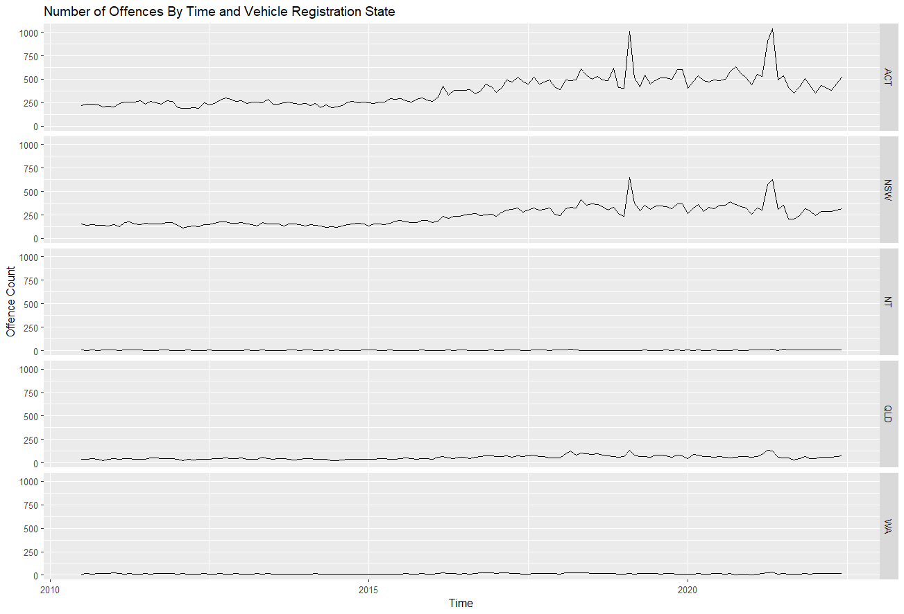
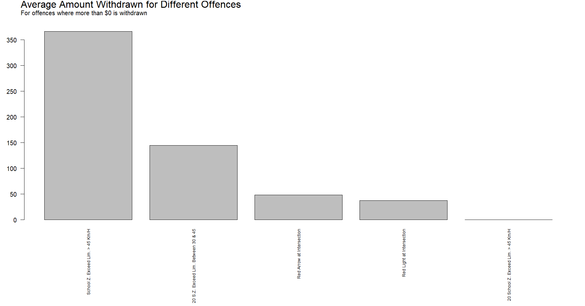
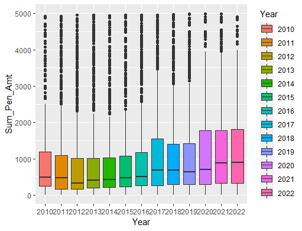
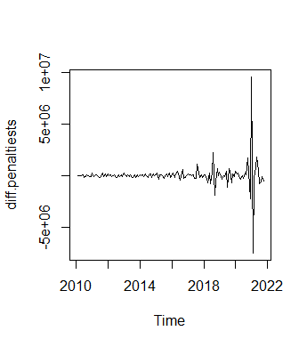
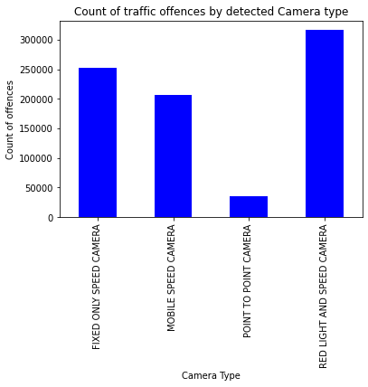
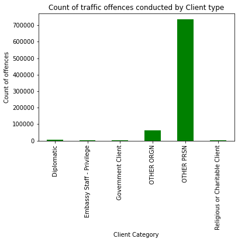

# 2022 mini-hackathon challenge 

**Team:** Bring Git On  

**Team members**:   
+ ashwin131 - data visualisation    
+ jar31 - data visualisation/ script integration  
+ julowi - main README    
+ mariegrimmond - data visualisation
+ mlm - main README      
+ SeanMalcolm - data visualisation
+ TheBigNords - data visualisation

**Challenge 2:** Open dataset  

The dataset we chose was the ACT traffic camera offenses public dataset, which can be found [here](https://data.gov.au/dataset/ds-act-https%3A%2F%2Fwww.data.act.gov.au%2Fapi%2Fviews%2F2sx9-4wg7/details?q). 

# Description of data

The dataset contains information about the traffic offenses 
caught by cameras in ACT by motorists and the fines issued to them.

Dataset contains 112,649 records over the period from *July 2010 
to June 2022*.

Each observation lists the following details about the traffic offenses and associated fines:
1. Month of the incident (*MMM-YY format*)
2. Vehicle registration state (*In addition to the states and territories in Australia, there are few special categories in this feature such as* **ARM, FED, NAV, RAF** )
3. Client type 
4. Tye of the camera that detected the offending vehicle
5. Location code
6. Detailed description of the location
7. Description of the offence
8. Sum of the penalty amount
9. Sum of the infringement amount
10. Sum of withdrawal amount in the month
11. Sum of withdrawal count in the month
 
# Visualisation outputs   

This beautiful map just speaks for itself and shows the traffic offence hotspots within the ACT. 

***

This time series plot shows that the majority of offenders are local, but NSW contributes a fair bit too.  

***

This plot is meant to help those with recent traffic offenses figure out if they have a chance at withdrawing their claim!  

   

*** 

This plot shows the amount of $$$ each offence costs on average. There's some major pricy outliers too! 

***

This plot shows the difference in penalities across time. Lots of penalities suddenly appearing in 2021!

*** 

These plots break down the type of offence committed by camera type and client type. 
 

